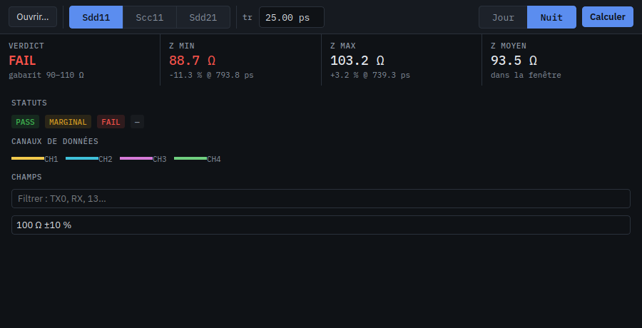
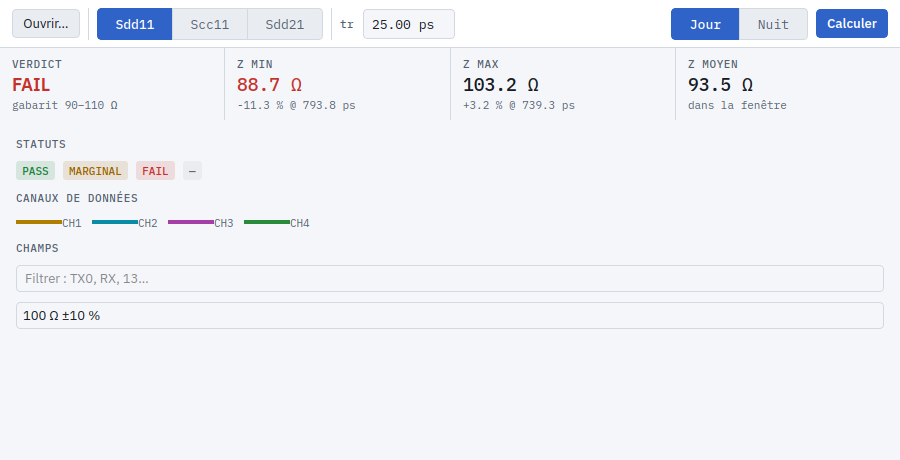

# aedt_ui_kit

Identité visuelle commune des toolkits AEDT (`aedt_tdr`, `aedt_eye`, `aedt_port_checker`) : thème sombre PyQt6, widgets réutilisables, polices IBM Plex embarquées.




## Principe

Trois rôles de couleur, jamais mélangés :

| Rôle | Jetons | Usage |
|---|---|---|
| Interaction | `accent` | boutons principaux, sélection, focus |
| Données | `ch1` jaune, `ch2` cyan, `ch3` magenta, `ch4` vert | courbes, dans l'ordre des canaux d'un oscilloscope |
| Statut | `pass`, `warn`, `fail` | verdicts, pastilles, valeurs hors gabarit |

Neutres : gris légèrement bleutés (`bg`, `s1`, `s2`, `line`, `fg`, `dim`). Les valeurs numériques sont en IBM Plex Mono, le texte en IBM Plex Sans.

## Thèmes Jour et Nuit

Deux palettes de mêmes jetons : `ui.DARK` (Nuit, par défaut) et `ui.LIGHT` (Jour). Les couleurs de données sont assombries en thème clair pour garder un contraste suffisant sur fond clair. Seuils vérifiés par les tests : texte et statuts ≥ 4.5:1, traces CH1 à CH4 ≥ 3:1, texte sur bouton principal ≥ 4.5:1.

```python
ui.apply(app, theme="light")      # au démarrage, ou pour changer de thème en cours d'exécution
ui.current_theme()                # "dark" | "light"
```

`ui.TOKENS` est un dictionnaire modifié en place : tout code qui lit `ui.TOKENS[...]` au moment de peindre suit le thème actif. Ce qui a figé une couleur dans une feuille de style locale doit être rafraîchi après un changement :

- `Pill.refresh()` et `KpiTile.refresh()` (appeler `refresh()` sur chaque instance, par exemple via `findChildren`).
- éléments pyqtgraph : réappliquer fond, axes, plumes et pinceaux depuis `ui.TOKENS` / `ui.color(...)`. Voir `_restyle_plot` dans `aedt_tdr`.
- préférer les propriétés (`setProperty("role", ...)`) et les noms d'objet aux `setStyleSheet` locaux : ils suivent le thème sans rafraîchissement.

## Installation

```bash
python -m pip install git+ssh://git@192.168.1.33/1ms/aedt_ui_kit.git
# graphes pyqtgraph :
python -m pip install "aedt-ui-kit[plot] @ git+ssh://git@192.168.1.33/1ms/aedt_ui_kit.git"
```

Ou copier le dossier `ui_kit/` dans le projet : il est autonome (PyQt6 seulement, pyqtgraph optionnel).

## Utilisation

```python
import sys
from PyQt6 import QtWidgets
import ui_kit as ui

app = QtWidgets.QApplication(sys.argv)
ui.apply(app)          # polices Plex, feuille de style, options pyqtgraph
window = MaFenetre()
window.show()
sys.exit(app.exec())
```

Widgets (`ui_kit/widgets.py`) :

| Widget | Rôle |
|---|---|
| `Segmented(items)` | commande segmentée exclusive, signal `changed(key)` |
| `Pill(verdict)` | pastille PASS / MARGINAL / FAIL / neutre |
| `KpiStrip(labels)` / `KpiTile` | bandeau d'indicateurs : libellé, grande valeur, sous-ligne |
| `DecimalSpinBox` | `QDoubleSpinBox` qui accepte « . » et « , » comme séparateur décimal, quelle que soit la locale (affichage avec « . ») |
| `caption(text)` | petit libellé monospace en capitales (`upper=False` pour εr, tr) |
| `vsep()` | séparateur vertical d'une barre d'outils |

Dans le code de l'application :

- `ui.TOKENS["fail"]`, `ui.color("ch1", alpha)` pour les couleurs, jamais de littéral hexadécimal.
- `ui.mono_font(size)` pour les axes pyqtgraph et les valeurs.
- Propriétés Qt reconnues par la feuille de style : `setProperty("primary", True)` sur un bouton, `setProperty("role", "hint" | "caption" | "conv")` sur un `QLabel`. Après un changement dynamique, appeler `ui.restyle(widget)`.
- Noms d'objet : `TopBar`, `SidePanel`, `Panel`.

## Démonstration

```bash
python demo.py                                  # fenêtre, bascule Jour / Nuit en haut à droite
QT_QPA_PLATFORM=offscreen python demo.py light docs/demo_light.png   # capture (dark ou light)
```

## Conventions d'interface

- Mesure et réglages d'échelon dans la barre d'outils, liste d'éléments à gauche, indicateurs au-dessus du graphe, hypothèses du calcul dans la barre d'état.
- Pas de `QMessageBox` pour une erreur ou une confirmation : message dans la barre d'état.
- Recalcul automatique avec anti-rebond (120 ms), sans bouton « Recalculer ».
- Pas de couleur sans rôle : une couleur de donnée n'est pas utilisée pour un état, ni l'inverse.

## Licences

Code : usage interne. Polices IBM Plex Sans et IBM Plex Mono : SIL Open Font License 1.1 (`ui_kit/fonts/OFL.txt`).

## Tests

```bash
python -m pip install pytest
pytest
```

Vérifient les séparateurs décimaux, la bascule de thème en place et les contrastes minimaux. Ils sont ignorés si Qt ne peut pas être importé (par exemple libGL absent dans une image CI).
